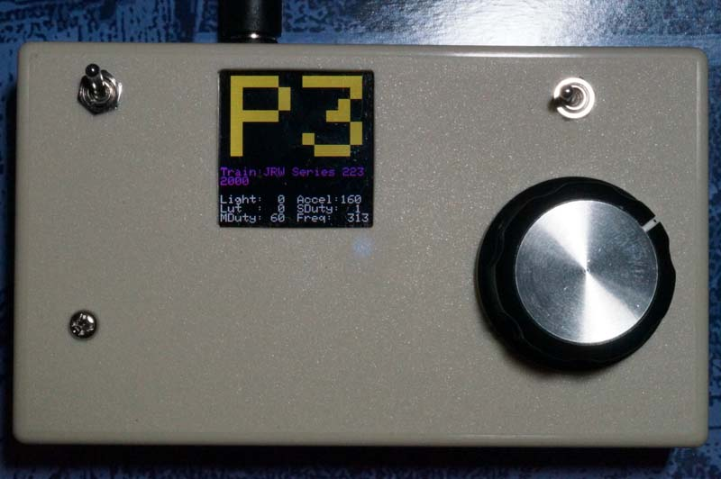

powerpack7
==========

DaVinci32u de Powerpack

Davinci32u (w/ Leonardo bootloader)でパワーパックを作ってみた　３台目

「ArduinoでPWMパワーパックを作ってみた」 しろくま氏  
"http://www.diotown.com/creative/2011/05/arduino-de-pwm-controller.html"  
にインスパイヤされ、自分も作ってみたくなった。  

https://www.youtube.com/watch?v=JGucmlXvMrI

Masuda Naika  
640-8425  
4-3-30, Mastue-kita, Wakayama city
